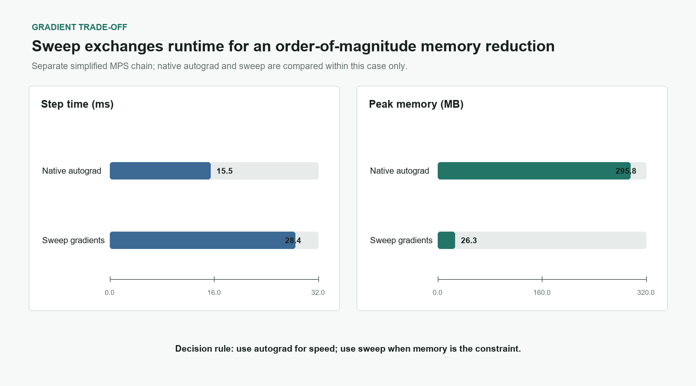
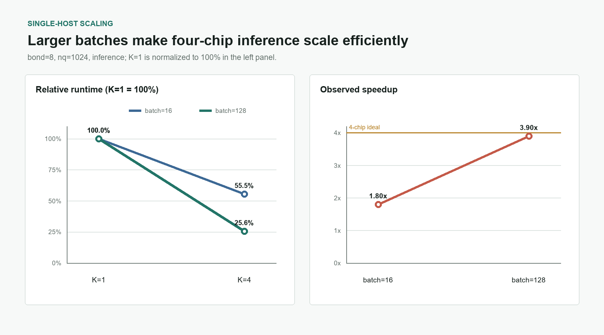
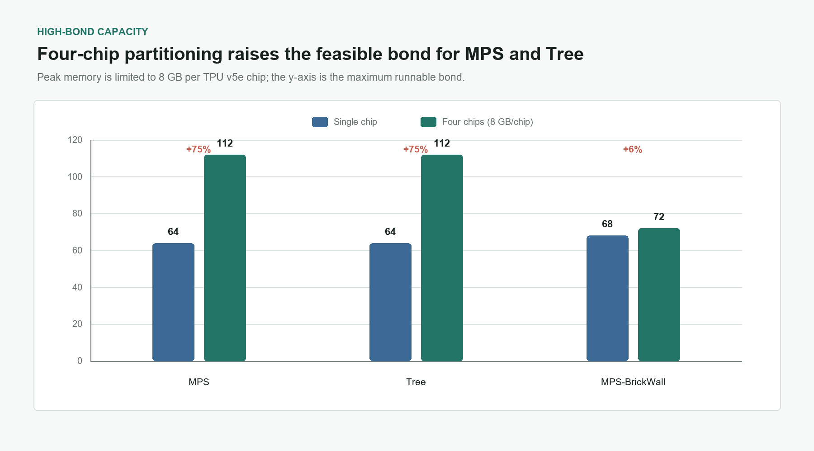

# TPU v5e Single-Chip Optimization and Multi-Chip Parallelism

*tneq-qc · JAX · Born Machine · August 2026*

## 1. Experimental Setup

All measurements were collected on TPU v5e. Single-chip and single-host multi-chip experiments use devices within one host and report both runtime and peak memory. The cross-host experiment uses four hosts with four chips per host, for a total of $K=16$. Because $K=16$ uses a different communication mechanism from the single-host path, it is evaluated only by peak memory; its runtime is not compared with the single-host results.

| Scenario | Topology | Metrics | Main case |
| --- | --- | --- | --- |
| Single-chip ablation | One TPU | Runtime and peak memory | Arena: MPS, bond=2, 64 qubits, batch=1024; sweep uses a separate simplified MPS chain |
| Single-host parallelism | $K=1/K=4$ | Runtime and peak memory | MPS, bond=8, 1024 qubits, batch=16/128 |
| Cross-host parallelism | Four hosts, $K=16$ | Peak memory only | MPS, bond=8, 1024 qubits, batch=16 training |
| High-bond capacity | One chip/$K=4$ | Maximum bond under 8 GB/chip | 16-qubit forward contraction for MPS, Tree, and MPS-BrickWall |

The single-chip, $K=4$, and $K=16$ results are from the current TPU v5e measurements. The high-bond capacity data are carried over from the project's existing TPU benchmark measurements. Timed runs are compiled with `jax.jit`, warmed up, and then averaged over 20--30 repetitions. Peak memory is read from the runtime's `peak_bytes_in_use` counter. Numerical results agree with the reference implementation to relative error on the order of $10^{-7}$--$10^{-6}$.

## 2. Single-Chip Ablation

The two single-chip optimizations target different bottlenecks. Arena, implemented by `compact_storage()`, places a group of otherwise separate tensors into a preallocated contiguous buffer and accesses them by position within that buffer. This reduces allocation, addressing, and movement overhead for many small tensors, at the cost of retaining the shared buffer. Sweep changes the gradient calculation: it constructs local environments and evaluates local gradients instead of retaining the full reverse-mode activation state for the entire chain. Sweep therefore trades additional contractions and runtime for substantially lower peak memory. The arena and sweep results use different test cases and must be compared only within each case.

| Case | Configuration | Step time | Peak memory | Interpretation |
| --- | --- | ---: | ---: | --- |
| Arena case | `jit` baseline | 0.444 ms | 6.4 MB | Reference |
| Arena case | `jit + arena` | **0.168 ms** | 11.6 MB | 2.65x faster; +5.2 MB |
| Gradient case | Native autograd | **15.46 ms** | 295.8 MB | Speed-oriented |
| Gradient case | Sweep gradients | 28.42 ms | **26.3 MB** | Memory-oriented; about 1/11 of autograd |

In the arena case, step time falls by 62.2%, from 0.444 ms to 0.168 ms, while peak memory rises from 6.4 MB to 11.6 MB. In the separate gradient case, sweep is about 84% slower than native autograd but reduces peak memory by about 91%.

> Use arena when single-chip runtime is the primary constraint. Evaluate sweep when peak memory is the limiting resource.

## 3. Multi-Chip Parallelism

The multi-chip route partitions the tensor network into $K$ blocks with KaHyPar, assigns each block to one TPU chip, contracts blocks locally, and then reduces the boundary tensors. This section separates single-host $K=1/K=4$ scaling, cross-host $K=16$ memory, and high-bond capacity.

### 3.1 Low Bond on One Host: $K=1/K=4$

The complete low-bond comparison uses a 1024-qubit MPS Born Machine with bond=8. Because $K=1$ and $K=4$ run on the same host, both runtime and peak memory are reported.

| Qubits | Batch | Phase | $K=1$ | $K=4$ |
| ---: | ---: | --- | --- | --- |
| 1024 | 128 | Inference | 956.5 ms / 2.7 GB | **245.0 ms** / 1.8--2.8 GB (3.90x) |
| 1024 | 16 | Inference | 63.6 ms / 3.2 GB | **35.3 ms** / 2.6--3.6 GB (1.80x) |
| 1024 | 16 | Training | 256.7 ms / 3.75 GB | **179.7 ms** / 2.6--4.1 GB (1.43x) |

At batch=16, $K=4$ inference takes 55.5% of the $K=1$ runtime, corresponding to 1.80x speedup and 45.0% parallel efficiency. At batch=128, the runtime ratio falls to 25.6%, giving 3.90x speedup and 97.5% parallel efficiency. Training reaches 1.43x speedup and 35.8% parallel efficiency because backpropagation and cross-block gradient collection reduce the parallel fraction.

> The primary criterion for low-bond partitioning is per-block workload, not chip count. Larger qubit and batch dimensions better amortize fixed scheduling and transfer costs.

### 3.2 Cross-Host $K=16$: Memory Only

The $K=16$ configuration uses four hosts with four TPU chips per host. $K=4$ transfers data between devices in one host, whereas $K=16$ additionally exchanges boundary tensors across hosts. Because the communication path and fixed overhead are different, this section reports peak memory only and does not compare runtime.

| Qubits | Batch | Phase | $K=4$ peak memory | $K=16$ peak memory (four chips per host) |
| ---: | ---: | --- | --- | --- |
| 1024 | 16 | Training | 2.6--4.1 GB | Coordinator: about 3.1--3.2 GB; other three chips: 1.5--2.2 GB |

Partitioning across 16 chips lowers memory on the ordinary compute chips, but the coordinator on each host retains an additional boundary-aggregation buffer. The measured memory imbalance means that the coordinator, rather than an ordinary compute chip, remains the relevant capacity constraint.

### 3.3 High Bond: Capacity under 8 GB per Chip

The high-bond experiment uses a 16-qubit Born Machine and forward inference only. Each TPU v5e chip is limited to 8 GB of peak memory. The metric is not runtime but the maximum runnable bond on one chip and with four-chip partitioning.

| Model | One-chip maximum bond | Four-chip maximum bond | Observed increase |
| --- | ---: | ---: | ---: |
| MPS | 64 | **112** | 1.75x |
| Tree | 64 | **112** | 1.75x |
| MPS-BrickWall | 68 | **72** | 1.06x |

Intermediate tensors in MPS and Tree are more sensitive to bond dimension, and four-chip partitioning raises their maximum bond from 64 to 112. MPS-BrickWall has a flatter memory curve and increases only from 68 to 72. The observed MPS/Tree ratio, $112/64=1.75$, is higher than the $4^{1/4}\approx1.41$ ratio predicted by a strict $D^4$ memory law with four times the aggregate memory. The feasible bond also depends on discrete search points, intermediate-tensor shapes, and partition balance, so it cannot be explained by one power law alone.

## 4. Conclusions and Deployment Guidance

| Objective | Recommended configuration | Evidence |
| --- | --- | --- |
| Single-chip speed | `jit + arena` | 2.65x speedup in the standard case |
| Single-chip memory | Sweep gradients | Peak memory reduced to about 1/11 |
| Single-host speedup | $K=4$, preferably with a large batch | 3.90x inference speedup at batch=128 |
| Cross-host memory | $K=16$; compare memory only | Ordinary chips use 1.5--2.2 GB in the measured training case |
| High-bond capacity | Four-chip KaHyPar partitioning | MPS/Tree maximum bond rises from 64 to 112 |

The remaining measurement gap is a continuous bond--memory curve for the high-bond cases. Filling that curve would make it possible to define a more reliable partitioning threshold and quantify how close each configuration is to the 8 GB/chip limit.
